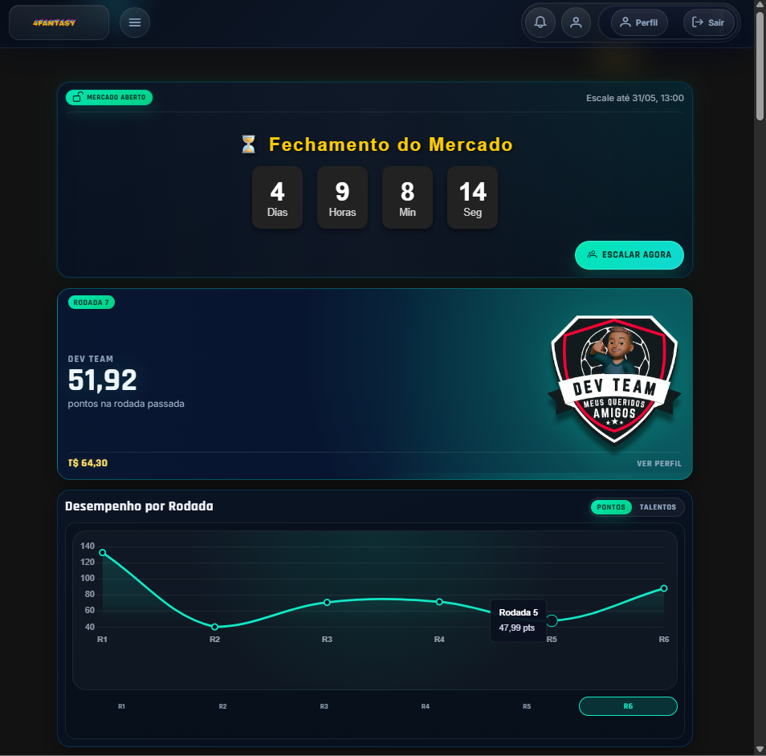
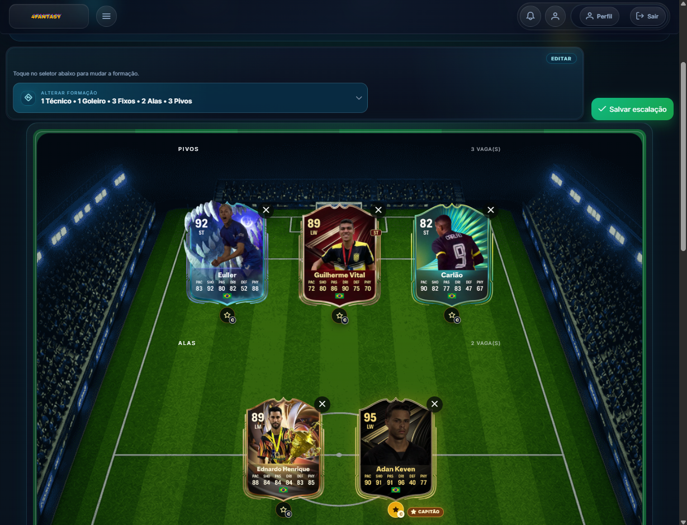
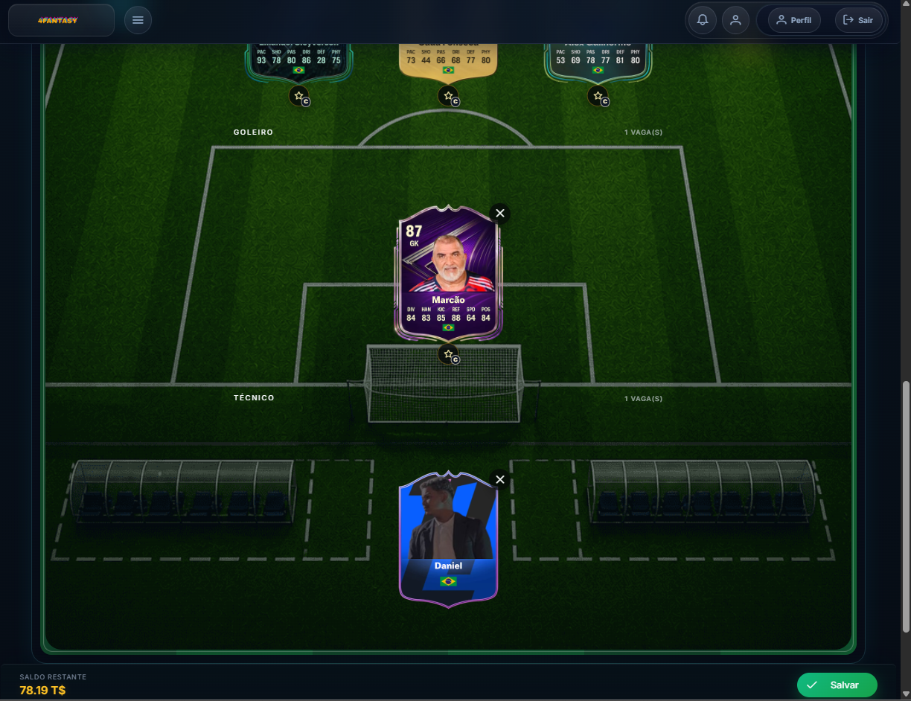
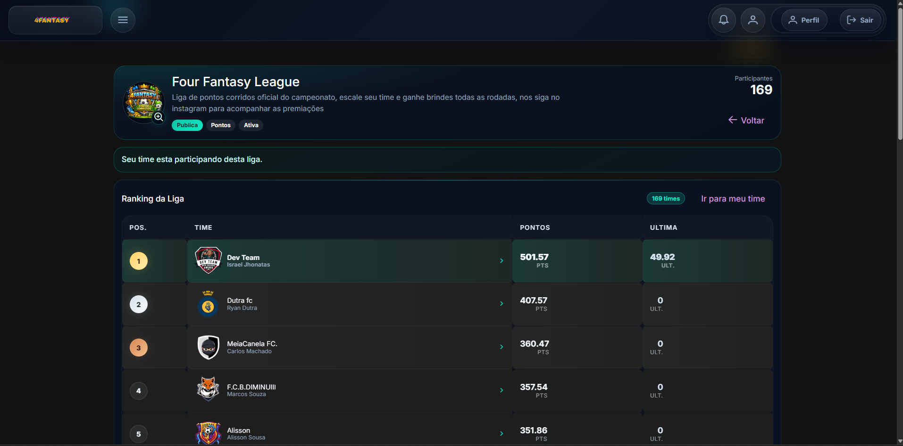
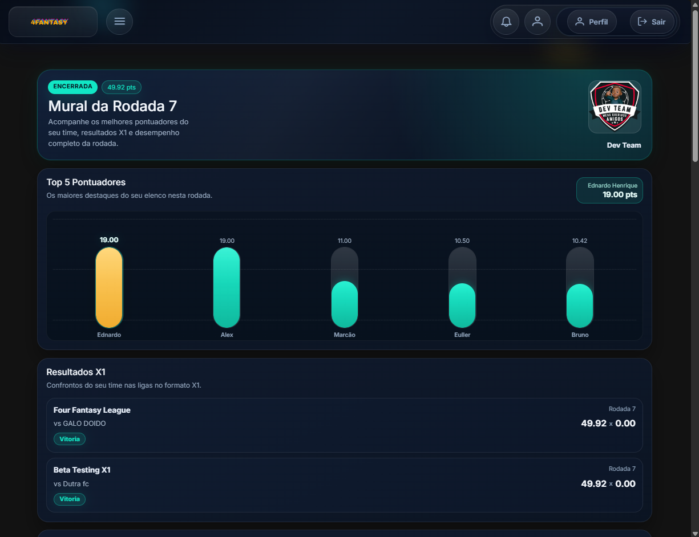

# 4Fantasy Platform — Technical Case Study

> A full stack fantasy sports platform case study built around real-world business rules, scalable architecture, performance strategy and product-oriented engineering.

---


## Overview

**4Fantasy** is a fantasy sports platform designed to manage fantasy teams, real teams, players, leagues, rounds, matchups, rankings, achievements and performance-based scoring.

This repository is a **public technical case study** of the platform.  
The production source code is private because the project is intended for commercial use.

The goal of this repository is to demonstrate how the platform was designed from a software engineering perspective, covering:

- System architecture
- Database modeling
- REST API design
- Angular frontend structure
- Business rules
- Performance strategy
- Product roadmap
- Commercial-readiness considerations

This case study was created to document the technical decisions behind the project without exposing private implementation details, credentials, real user data or sensitive business logic.

---

## Why This Project Exists

Fantasy sports applications are not simple CRUD systems.

They require:

- Real-world domain modeling
- Round-based scoring
- Player performance tracking
- League-specific rankings
- Fantasy team matchups
- Historical data consistency
- Admin workflows
- Mobile-first user experience
- Performance optimization for read-heavy screens
- Secure handling of user and competition data

**4Fantasy** was created to explore these challenges in a real product context using a modern full stack architecture.

---

## Product Concept

4Fantasy allows users to create fantasy teams, join leagues, select players, follow round results, compete in matchups and track rankings based on real-world sports events.

The platform connects two main contexts:

| Context | Description |
|---|---|
| Real Sports Context | Real teams, real players, real matches and match events. |
| Fantasy Context | Fantasy teams, lineups, leagues, scores, matchups and rankings. |


High-level flow:

```txt
Real Match Event
 |
 v
Player Round Score
 |
 v
Fantasy Team Score
 |
 v
Matchup Result
 |
 v
League Ranking
```

---

## Tech Stack

### Backend

- C#
- .NET 8
- ASP.NET Core
- Entity Framework Core
- PostgreSQL
- REST APIs
- Service-oriented architecture
- DTO-based API contracts
- Background processing concepts
- Performance-oriented read services

### Frontend

- Angular
- TypeScript
- PrimeNG
- SCSS
- Responsive UI
- Feature-based structure
- Reusable components
- Route guards
- HTTP interceptors
- Mobile-first user experience

### Database

- PostgreSQL
- Relational modeling
- EF Core migrations
- Indexing strategy
- Snapshot/read-model strategy
- Historical data preservation

### DevOps / Engineering Practices

- Git
- GitHub
- Azure DevOps concepts
- Environment-based configuration
- Documentation-first case study
- Commercial source code protection

---

## Main Features

The platform was designed around the following core features:

| Area | Features |
|---|---|
| Authentication | User login, registration and protected user access. |
| Messaging & Notifications | Internal messages, targeted recipients, push notifications and unread status tracking. |
| Fantasy Teams | Team creation, customization and user ownership. |
| Player Selection | Lineup creation, player filters and captain selection. |
| Leagues | Public/private league participation and league-specific rankings. |
| Rounds | Round status, lineup lock, scoring and historical data. |
| Matchups | Direct confrontations between fantasy teams. |
| Rankings | League and championship classification logic. |
| Real Matches | Admin registration of real matches and match events. |
| Scoring | Player score, team score and captain multiplier concepts. |
| Achievements | Gamification through badges and performance milestones. |
| Admin Panel | Management of players, real teams, rounds, matches and scoring. |
| Performance | Read-optimized endpoints, snapshots and indexing strategy. |

---

## Architecture Overview

4Fantasy follows a layered full stack architecture.

```txt
User
 |
 v
Angular Web Application
 |
 v
ASP.NET Core REST API
 |
 v
Application Services
 |
 v
Domain Rules
 |
 v
Entity Framework Core
 |
 v
PostgreSQL Database
```

### Main Responsibilities

| Layer | Responsibility |
|---|---|
| Angular Frontend | Provides user and admin interfaces. |
| API Layer | Exposes REST endpoints consumed by the frontend. |
| Application Layer | Coordinates use cases and business workflows. |
| Domain Layer | Represents fantasy sports rules and core entities. |
| Infrastructure Layer | Handles persistence, integrations and technical services. |
| Database | Stores users, teams, leagues, rounds, scores and historical data. |

For more details, see:

[Architecture Overview](docs/architecture.md)

---

## Database Design

The database model was designed to support a domain-rich fantasy sports platform.

Simplified model:

```txt
Championship
 |
 ├── Leagues
 |    |
 |    ├── Fantasy Teams
 |    |    |
 |    |    ├── Team Rounds
 |    |    └── Matchups
 |    |
 |    └── League Rankings
 |
 ├── Rounds
 |    |
 |    ├── Player Round Scores
 |    └── Team Round Scores
 |
 ├── Real Teams
 |    |
 |    └── Players
 |
 └── Real Matches
      |
      └── Match Events
```

The database strategy focuses on:

- Relational consistency
- Historical round preservation
- League-specific ranking context
- Matchup result storage
- Player and team scoring
- Snapshot-based reads
- Indexing for performance
- Avoiding overfetching in API responses

For more details, see:

[Database Overview](docs/database-overview.md)

---

## API Design

The backend exposes REST APIs designed around business resources.

Example API areas:

```txt
/api/auth
/api/users
/api/championships
/api/leagues
/api/teams
/api/players
/api/rounds
/api/lineups
/api/matchups
/api/rankings
/api/dashboard
/api/achievements
/api/admin
```

API design principles:

- Thin controllers
- Business logic inside application services
- DTO-based responses
- Clear request/response contracts
- Authentication and authorization
- Admin/user workflow separation
- Read-optimized endpoints
- Safe error responses
- Pagination and filtering where needed

For more details, see:

[API Overview](docs/api-overview.md)

---

## Frontend Structure

The frontend is organized using a feature-oriented Angular structure.

```txt
src/app/
 |
 ├── core/
 |    ├── auth/
 |    ├── guards/
 |    ├── interceptors/
 |    ├── models/
 |    └── services/
 |
 ├── shared/
 |    ├── components/
 |    ├── pipes/
 |    ├── directives/
 |    └── utils/
 |
 ├── features/
 |    ├── auth/
 |    ├── home/
 |    ├── team/
 |    ├── lineup/
 |    ├── league/
 |    ├── ranking/
 |    ├── round-summary/
 |    ├── matchups/
 |    ├── achievements/
 |    └── admin/
 |
 └── layout/
      ├── topbar/
      ├── sidebar/
      └── app-shell/
```

Frontend priorities:

- Mobile-first experience
- Reusable UI components
- Typed API services
- Route guards
- HTTP interceptors
- Loading skeletons
- Empty states
- Admin/user separation
- Responsive ranking and lineup screens
- Clear score and matchup presentation

For more details, see:

[Frontend Structure](docs/frontend-structure.md)

---

## Performance Strategy

Performance is a key concern because fantasy sports platforms have read-heavy screens.

Examples of read-heavy areas:

- Home dashboard
- League rankings
- Round summaries
- Matchup details
- Player lists
- Historical round results
- Admin match/event screens

The performance strategy includes:

- Read-optimized endpoints
- DTO projections
- Avoiding full entity graph loading
- Using `AsNoTracking` for read-only queries
- Database indexes for frequent filters
- Snapshot tables for closed rounds
- Pagination for large datasets
- Reduced frontend API calls
- Loading skeletons for perceived performance
- Observability for slow requests

Snapshot concept:

```txt
Live Data
 |
 v
Calculation Services
 |
 v
Snapshot Tables
 |
 v
Read-Optimized Endpoints
 |
 v
Angular Dashboard
```

For more details, see:

[Performance Strategy](docs/performance-strategy.md)

---

## Business Rules

4Fantasy includes business rules beyond basic CRUD operations.

Main rule areas:

| Area | Examples |
|---|---|
| Rounds | Open, in progress, closed and calculated states. |
| Lineups | Users can edit lineups only while the round is open. |
| Formation | Selected players must follow allowed formation rules. |
| Captain | Captain must be part of the lineup and may receive multiplier. |
| Scoring | Real match events generate player and team scores. |
| Matchups | Fantasy teams compete directly by round score. |
| Rankings | Wins, total score and tie-breakers define classification. |
| Achievements | Users unlock badges based on performance conditions. |
| Admin | Admin users manage real matches, events and recalculations. |

Example scoring flow:

```txt
Selected Players
 |
 v
Player Round Scores
 |
 v
Captain Multiplier
 |
 v
Fantasy Team Round Score
 |
 v
Matchup Result
 |
 v
League Ranking
```


For more details, see:

[Business Rules](docs/business-rules.md)

---

## Messaging and Notification Service

4Fantasy includes an internal messaging and notification service designed to improve user engagement and support operational communication inside the platform.

The system allows messages to be sent to all users, selected users or targeted groups based on business rules, such as users from a specific championship, league, fantasy team, round or event.

This feature supports use cases such as round updates, lineup reminders, matchup results, achievement unlocks, league updates and admin announcements.

From a technical perspective, the messaging service separates internal message storage from external push notification delivery. Messages and recipients are persisted in PostgreSQL using Entity Framework Core, while notification delivery can be processed asynchronously using Hangfire and sent to users through OneSignal.

The Angular frontend can display notifications through a notification center, unread counters and a topbar notification badge. SignalR is planned to support real-time updates for unread counters and instant notification feedback.

### Technologies Used

| Technology | Usage |
|---|---|
| ASP.NET Core | Backend API and messaging endpoints. |
| C# | Business logic and message processing. |
| Entity Framework Core | Persistence of messages and recipients. |
| PostgreSQL | Storage for messages, recipients and delivery status. |
| Angular | Notification center and user interface. |
| TypeScript | Frontend logic and typed API communication. |
| Hangfire | Asynchronous background processing. |
| OneSignal | Push notification delivery. |
| SignalR | Planned real-time notification updates. |
| REST APIs | Communication between frontend and backend. |

### High-Level Flow

```txt
Admin or System Event
 |
 v
Message Creation
 |
 v
Recipient Selection
 |
 v
Internal Message Storage
 |
 v
Background Processing
 |
 v
Push Notification Dispatch
 |
 v
Angular Notification UI
```

This feature demonstrates backend workflow design, asynchronous processing, push notification integration, user targeting logic, database modeling, frontend notification UX and product-oriented communication.


For more details, see:

[Messaging and Notification Service](docs/messaging-and-notification-service.md)


## Roadmap

The roadmap is organized into technical and product evolution phases.

| Phase | Focus |
|---|---|
| Phase 1 | Foundation stabilization |
| Phase 2 | Scoring and ranking reliability |
| Phase 3 | Performance optimization |
| Phase 4 | Admin experience improvements |
| Phase 5 | Gamification and engagement |
| Phase 6 | Product polish and mobile experience |
| Phase 7 | Observability and operational readiness |
| Phase 8 | Commercial readiness |

For more details, see:

[Roadmap](docs/roadmap.md)

---

## Screenshots

| Screenshot | Suggested File |
|---|---|
| Home dashboard | `images/dashboard.png` |
| Lineup selection | `images/lineup.png` |
| League ranking | `images/league-ranking.png` |
| Round summary | `images/round-summary.png` |
| Architecture diagram | `images/architecture-diagram.png` |
| Admin match event screen | `images/admin-match-events.png` |
| Player card/list | `images/player-selection.png` |
| Mobile dashboard | `images/mobile-dashboard.png` |


```md





```


---

## Repository Structure

```txt
4fantasy-platform-case-study/
 |
 ├── README.md
 |
 ├── docs/
 |    ├── architecture.md
 |    ├── database-overview.md
 |    ├── api-overview.md
 |    ├── performance-strategy.md
 |    ├── frontend-structure.md
 |    ├── business-rules.md
 |    ├── messaging-and-notification-service.md
 |    └── roadmap.md
 |
 └── images/
      ├── dashboard.png
      ├── lineup.png
      ├── league-ranking.png
      ├── round-summary.png
      └── architecture-diagram.png
```

---

## Public Case Study Scope

This repository is intentionally documentation-focused.

It demonstrates:

- Product thinking
- Full stack architecture
- Backend design
- Angular frontend organization
- Relational database modeling
- REST API planning
- Business rule modeling
- Performance awareness
- Commercial product maturity
- Technical communication in English

It does not expose:

- Production source code
- Real user data
- Credentials
- Environment variables
- Private business formulas
- Sensitive implementation details
- Commercial secrets
- Production database schema in full detail

---

## Why the Source Code Is Private

The production source code is private because 4Fantasy is intended for commercial use.

This public case study exists to share the engineering approach behind the platform while protecting intellectual property, sensitive implementation details and real user data.

A technical walkthrough can be provided upon request.

---

## What This Case Study Demonstrates

This project demonstrates experience with:

- Full stack product development
- C# and .NET backend development
- ASP.NET Core REST APIs
- Angular and TypeScript frontend development
- PostgreSQL relational modeling
- Entity Framework Core
- Complex business rules
- Performance optimization strategy
- API contract design
- Feature-based frontend organization
- Admin workflow design
- Historical data consistency
- Documentation and technical communication

---

## Author

**Israel Jhonatas**  
Full Stack Developer  
.NET | Angular | PostgreSQL | Entity Framework Core | REST APIs | TypeScript

GitHub: `https://github.com/IsraelJulio`  
LinkedIn: `https://www.linkedin.com/in/israeljhonatas`

---

## Status

This case study is actively evolving as the 4Fantasy platform grows.

Future improvements may include:

- Additional architecture diagrams
- Mock screenshots
- API contract examples
- Database relationship diagrams
- UI flow documentation
- Deployment strategy
- Technical decision records
- Product demo with mock data

## Roadmap
- Athlete registration area
- Google authentication
- Internationalization
- knockout stage view
